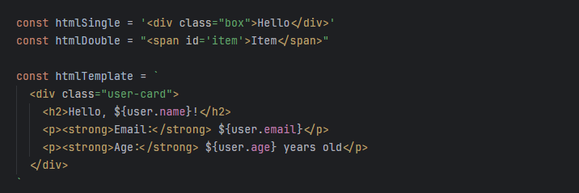
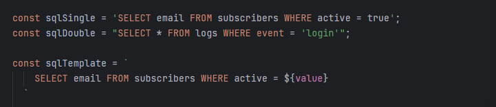
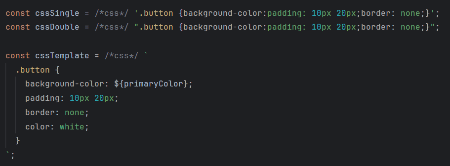

# JS/TS String Syntax

**JS/TS String Syntax** is a Visual Studio Code extension that highlights HTML, XML/SVG, SQL and CSS embedded in JavaScript and TypeScript strings. The extension automatically infers HTML, XML/SVG, and SQL content by default, while CSS requires explicit language markers to identify and apply syntax highlighting.

## Features

- **Automatic Language Detection**: Infers and highlights HTML, XML/SVG, and SQL content in JavaScript and TypeScript strings without requiring explicit markers.
- **Explicit Language Markers**: Supports comment-based language markers (`/*html*/`, `/*xml*/`, `/*svg*/`, `/*sql*/`, `/*css*/`) for explicit language specification when needed.
- **Multiple String Types**: Works with all JavaScript/TypeScript string types including single quotes (`'`), double quotes (`"`), template literals (`` ` ``), and basic tagged templates.
- **Compatibility with Other Editors**: The use of language markers does not interfere with syntax in other editors or IDEs.

### Current Support

- **HTML** (auto-detected and with explicit marker)
- **XML/SVG** (auto-detected and with explicit marker)
- **SQL** (auto-detected and with explicit marker)
- **CSS** (with explicit marker)

### Example

#### HTML Example



#### SQL Example



#### CSS Example



Visual Studio Code will apply HTML, XML/SVG, SQL, and CSS syntax highlighting to the content of the strings, improving readability and streamlining development.

### Customization

Some themes will require customizing the appearance of embedded code by adding TextMate scopes to your VS Code configuration. Below is a basic configuration for the `settings.json` file, but you can add more scopes as needed for your specific customization requirements:

```json
"editor.tokenColorCustomizations": {
    "textMateRules": [
      {
        "scope": [
          "string.quoted text.xml.embedded",
          "string.quoted text.html.embedded",
          "string.quoted source.sql.embedded",
          "string.quoted source.css.embedded"
        ],
        "settings": {
          "foreground": "#ABB2BF"
        }
      },
    ]
}
```

You can modify the hex color values to match your preferred color scheme.

### Installation

1. Open Visual Studio Code.
2. Go to the Extensions view (Ctrl+Shift+X or Cmd+Shift+X on Mac).
3. Search for **JS/TS String Syntax**.
4. Click "Install."

### Feedback

Your feedback is invaluable! If you encounter any issues or have suggestions for improvements, please [report them](https://github.com/ericgomez/vscode-js-string-syntax/issues) here.

### License

This extension is licensed under the MIT License. See the [LICENSE](./LICENSE) file for details.

Enjoy coding with **JS/TS String Syntax**! 🚀
